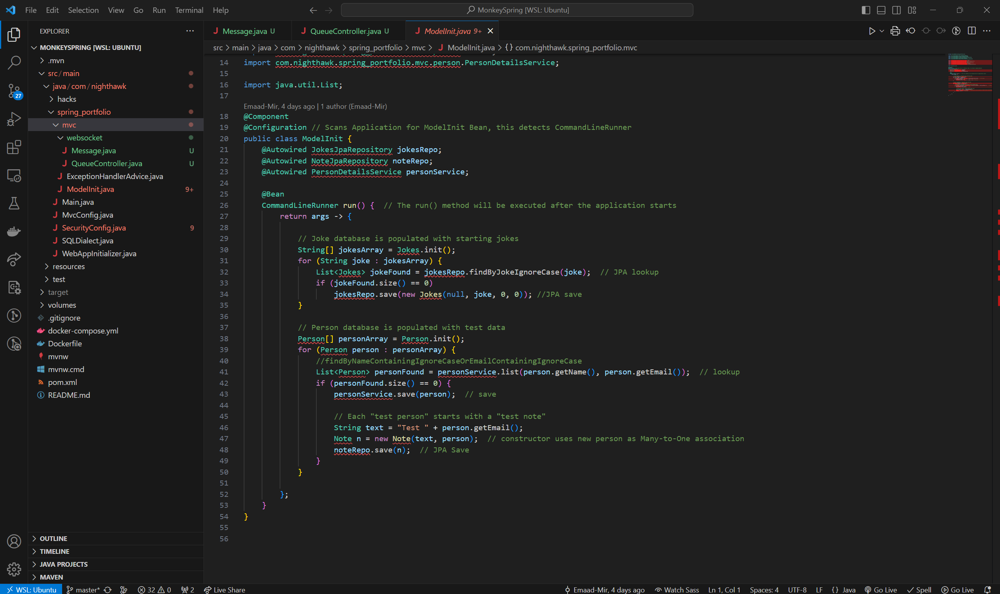
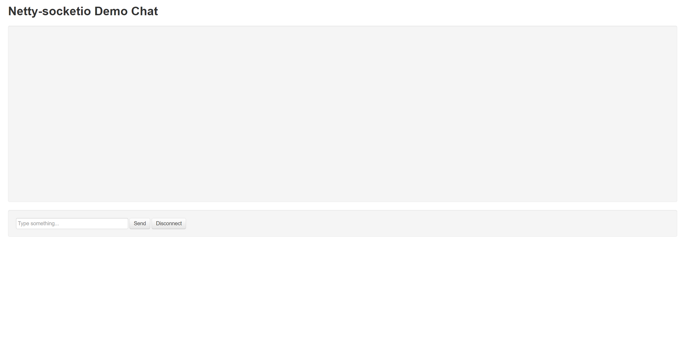
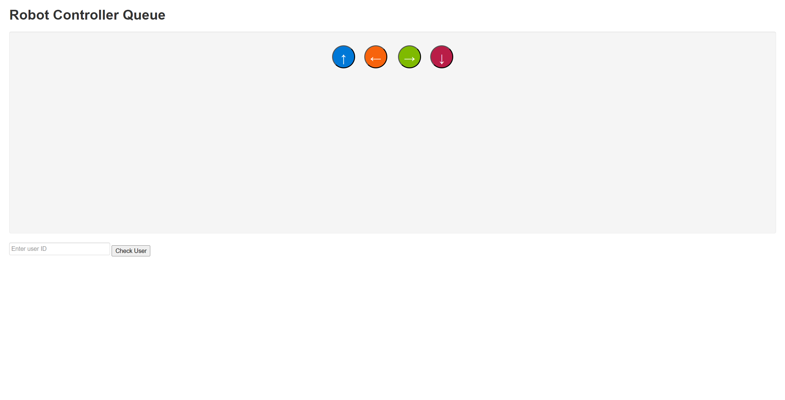

# Overview of Socket

To recap, socket.io is a library that allows a connection to be established between a server and a client. For our robot, the socket.io essentially served as our Java backend, since much of the code that we wrote to create components such as the queue and userId were written in Java. At the same time, however, there was a little bit of frontend that used socket.io as well, but Java was the more dominant language in this case.

# Components of the Socket Portion

As we planned out or project during Ideation week, we proposed the following ideas:

- A queue of users who are to control the robot
- Notification for every time a new client/user joins the server
- Message that displays the number of people in line that are in front of another person

We ended up trying to go about this twice, once with the Spring Portfolio provided by Mr. Mortensen and the second time with the repository for a client-server framework called Netty. 

## Spring Portfolio

We tried to create the backend using Spring, and I made sure to add the necessary dependencies such as netty in order to get the server working the way we wanted to. However, we ran into several issues, some of which caused us to take a different approach in incorporating socket.io into our project. 

### Issue: Many Red Lines Throughout Code (Resolved)

One of the main issues with our Spring Portfolio was that whenever we tried to add code to several Java files, we would notice that there were an oddly high number of reported errors in our code, even though everything looked like it should have been processed as ok. Below is an example of what the portfolio looked like as we opened it in VSCode:

Mr Mortensen, thankfully, suggested that we try running his project (unchanged) on my machine. When we recloned the repository and tried that, everything seemed to be working okay. So what was the solution? It turned out that we were getting all of those errors because of where I placed the websocket folder. Mr. Mortensen told us that the package statement at the very top should have had an mvn, but ours did not. All we had to do was make websocket its *own* folder (not within mvc) so that everything would process correctly (which did happen!)

While there are several other issues we ran into, they were generally much smaller and easier to solve; however, because it was just in general very difficult to use Spring to create a queue that functions the way we wanted it to, we ended up deciding to resort to another repository that we found that uses a client-server framework called netty.

## Netty Demo Repo

This repository ended up being quite different from Spring portfolio in that both the frontend and the backend were in the same repository. This was a bit unusual, as we normally would have expected to have the frontend and backend running from two different projects. The benefit of this repository was that it had a chat system that printed out a message for anytime a new client joined and provided the client's unique id (which is normally just a bunch of random characters). Before we made any changes, the repo looked like this:

Now, after we modified the system to better fit our project, the new page looks like this:

The colored buttons represent the directions in which the robots can go in. Once a person who is in front of the queue has control of the robot, they can move the robot in the direction corresponding to the arrow shown on the button. In console and terminal, you can even get a view of the motor functions being called whenever the button is pressed on. The button that checks for the user id is intended to check to see if a certain id indeed exists within the queue. While there were several benefits to using this repository over the Spring Portfolio, there were also a few issues we ran into while trying to use this.

### Issue 1: Being Able to Deploy the Server on the Raspberry Pi

As Varalu mentioned in his explanation of the robot's hardware, the raspberry pi was what we used to power the Dual H Bridge. Our goal was to be able to deploy the server side of our project using the raspberry pi, and we went about this by adding the dependency for raspberry pis to our pom.xml file. Even after adding the dependency, however, we kept getting a strange error showing up in the console (get or resource error). 

#### Issue 2: Implementing the Queue System

While I was able to create the base code in making the queue for our robot controllers, the main issue we had was getting the functions that checked to see if a user existed to work. Tirth came up with the idea of using semaphore, which is a Java platform that can be used to limit the connections to the server. The idea was that by having the first client join, they will be able to control the robot as long as they want until they leave. Once they leave, the next player, which was previously given an error due to already being occupied, would be able to control the robot next. We initially thought that this worked, as we noticed that the first user that joined had no error show up in the console while the second one did. However, upon closing the tab of the first client, the second client continued to have the error show up in the console, which was an indication that we were on the right track but just had something off in our code. 

# Reflection

Overall, even though we ran into many, many errors relating to socket.io as we worked on this project, we ended up learning a lot about web-connected robots and website development in general. It was fun whenever the entire team met up together, especially as we were working on building the actual robot. Even though this project did require a lot of materials, everyone was able to pitch in and we were all able to work together to produce a fun and distinct project this trimester. If possible, some of our team members are considering carrying this project over for the whole year and adding new features to the robot as we progress through the year. 

